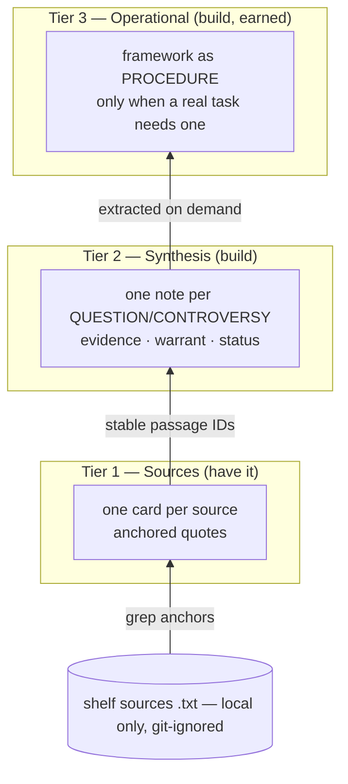
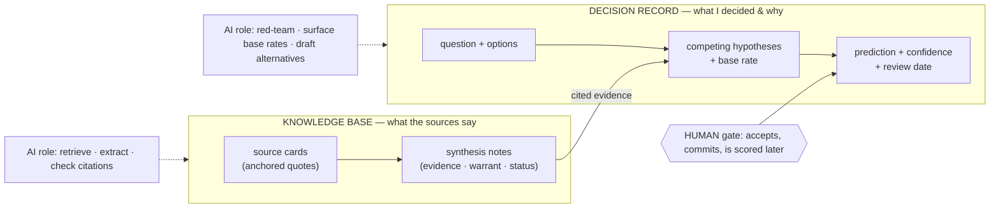

# Research conclusion: a verifiable, compounding knowledge base for domain research and agent delegation

**Date:** 2026-07-21
**Scope:** How to evolve lodlib from a source-provenance tool into a system that supports (1) deep
domain research, (2) thinking and creating with absorbed frameworks — including agent delegation, and
(3) fast, accurate retrieval. Grounded in current-trend research (2026) and an adversarial second
opinion from Codex (gpt-5.6-sol, high effort).

This document is the *conclusion*. It records what was decided and why, so it can be audited later. It
is deliberately opinionated; where the evidence is weak or contested, that is stated inline.

---

## 1. The problem, stated plainly

The goal is not a notes system. It is a **compiled, verifiable, compounding domain model** with three
products at increasing distance from the source text:

1. what each source *verifiably says*,
2. what *you* conclude across sources,
3. what your *agents* operate on.

lodlib today solves (1) well and touches (3). It cannot yet express (2), which is the layer you
actually think with — because its unit of organization is **the source**, while ideas span many
sources.

---

## 2. Current state (verified)

- **lodlib**: ~1,100 lines, stdlib-only Python 3.11+, zero dependencies. One Markdown card per source,
  four Levels of Zoom (L0 meta / L1 thin / L2 full / L3 raw text). Every summary claim carries a
  `(grep: "exact phrase")` anchor; `lib check` fails CI when an anchor no longer resolves
  ("citation rot"). Sources are git-ignored (copyright); cards are tracked.
- **Corpus**: adopted from `../doxai` into `~/research/doxlib/` — 129 cards, 128 `.txt` sources across
  5 shelves (craft/narratology/papers/science/secondary), 21 PDFs, plus a mostly-dormant frameworks
  layer (20 framework cards + 9 syntheses). `lib check` passes clean (0 errors, 0 warnings) in ~1s.

### 2.1 Two verified defects in the guard (still outstanding)

Both confirmed by direct test; fixes prototyped and shown not to regress the 22-test suite.

| Defect | Location | Symptom | Fix |
|---|---|---|---|
| **Regex fail-open** | `common.py` `occurs()` regex fallback | a failed literal match is retried *as a regex*, so quoted `()` or `?` silently matches text the source does not contain — a **false PASS in the one check that must never fail open** | make regex matching opt-in; literal by default |
| **De-hyphenation is one-directional** | `common.py` `haystacks()` (`nohy = flat.replace("-","")`) | strips the hyphen but leaves the wrap-introduced space, so `behav-\nior` never matches the anchor `behavior` — the canonical pdftotext case the guard claims to handle | fold `-\s*` on both source and needle; add the missing combined hyphen+wrap test |

A third, lower-severity item: `lib search` ranking is `blob.count(term)` (`cli.py`), which biases toward
the longest card (no length normalization).

---

## 3. Target architecture (after the Codex debate)

The skeleton — keep the guard, add a synthesis layer, procedures-not-personas, grep-first retrieval,
no vector DB, minimize bespoke code — survived review. Codex applied consistent downward pressure
toward *epistemic humility*, and every correction improved the design. The corrections are folded in
below.

### 3.1 The single most important correction

The guard is **referential integrity, not verification.** It proves an anchor still *resolves*; it
does **not** prove the quote *entails* the claim, that the source is credible, or that qualifications
were preserved. Green `lib check` means "no citation rot," never "this is true." The gap is harmless
at Tier 1 (the claim ≈ the quote) and widens dangerously the moment you synthesize. Keep the guard;
stop calling it verification.

### 3.2 The tiers

- **Tier 1 — Sources.** Unchanged. Source-anchored literature notes.
- **Unit change — anchors become stable evidence IDs.** An anchor resolves to a *raw-source passage*
  via a stable ID. Tier 1 and Tier 2 are alternate **views over the same passage IDs**, not a chain
  where one paraphrase feeds the next. This prevents a mistaken Tier-1 paraphrase from being laundered
  into several apparently-supported concept notes.
- **Tier 2 — Question / controversy notes, not "one page per idea."** Concepts have no stable
  boundaries (a page titled "agency" becomes an incoherent warehouse); questions do (a page titled
  "When does narratorial unreliability depend on reader inference rather than textual contradiction?"
  has a reason to exist and a testable scope). Organize synthesis around questions.
- **Tier 3 — Operational frameworks, earned not universal.** "Procedure not persona" holds
  (expert-persona prompting improves alignment but *hurts* accuracy), but a framework is
  operationalized into steps/decision-rules **only when a real workflow demands it**. Most frameworks
  are lenses/taxonomies/traditions, not algorithms; forcing steps creates false precision.

### 3.3 The synthesis contract (Tier 2)

A synthesized claim is *your* work across several sources — genuinely not a quote. Do not force it to
look like one; force it to **expose its argument**:

| Field | What | Machine-checkable? |
|---|---|---|
| **Evidence** | anchored passages (stable IDs → raw source) | Yes — linter confirms they resolve |
| **Warrant** | *your* explanation of how the passages support the claim | No — human/agent judgment |
| **Judgment** | the claim, **labeled**: reported-consensus / contested / extrapolation / hypothesis / conclusion | No |
| **Scope** | where it holds; where unknown | No |
| **Counterevidence** | what argues against it (anchored) | Yes resolves / No sufficiency |

The linter verifies every Evidence and Counterevidence pointer resolves. It **cannot** validate the
warrant or the label — and the data model must make that boundary explicit. This is the verification
contract for synthesized knowledge.

### 3.4 Compounding — detection yes, autonomous rewrite no

Silent consolidation is where **epistemic laundering** happens: an agent rewrites five qualified
claims into one fluent consensus claim, the anchors stay valid, and the system grows *more confident
while losing nuance*. Therefore:

- A consolidation pass may **detect and propose** ("these two notes overlap / contradict") as a
  reviewable diff.
- It may **never** autonomously rewrite canonical synthesis.

Candidate generation is cheap; promotion to doctrine requires a human.

### 3.5 Retrieval — measure before building

Agentic grep-first is the default (Claude Code dropped embeddings for pure agentic search). Do **not**
jump to BM25 blindly: at 130–500 sources, retrieval failure comes more from poor source text, missing
aliases, weak metadata, and OCR errors than from term-count scoring. Build a small eval set (~15 real
questions with known-relevant passages), measure, and only then adopt a boring local index (SQLite
FTS5 has BM25 built in). No vector DB at this scale; embeddings remain an optional sidecar only if
vocabulary-mismatch recall is proven to be the gap. The `aliases:` field is the cheap manual patch for
that.

---

## 4. How professionals harness AI (cross-domain research)

Seven professions that do not share notes — litigation, management consulting, intelligence analysis,
buy-side investing, clinical medicine, academic research, AI engineering — have **independently
converged** on the same operating model. The convergence is the finding.

> **One line:** the professionals who use AI well do not ask it what is true — they make it retrieve
> from a corpus they govern, cite to sources they can check, and keep a human accountable for the
> decision. The AI drafts and argues; it never commits.

### 4.1 Managing the knowledge base — five recurring practices

| # | Practice | Evidence | Lesson for us |
|---|---|---|---|
| 1 | Ground in a curated corpus, not model memory | McKinsey Lilli: RAG over 40+ curated sources / 100k docs, 72% monthly use. Harvey/CoCounsel: grounded in Westlaw. UpToDate: trusted clinical content | lodlib's premise is already frontier-aligned |
| 2 | **Governance is the bottleneck, not the model** | Governed RAG 85–92% accuracy vs ungoverned 45–60%. Glean has "no certified source of truth." Same doc in 3–5 versions → non-deterministic retrieval. 40–60% of enterprise RAG never reaches production | lodlib's enforced one-card-per-source bijection **is** the governance enterprises fail at — the strongest validation of the existing design |
| 3 | Verification stays human even with grounding | Law: verify every citation; 17 hallucination rulings in one day (Mar 2026). Medicine: "decision support, not decision maker; every output requires physician review" | never drop the human check — matches §3.1 |
| 4 | Freshness rot is a distinct failure | "Stale documents receive high confidence scores while current information ranks lower" | citation-rot ≠ knowledge staleness; add supersession/review dates — the gap that breaks first at scale |
| 5 | Split extraction from synthesis; stack tools | Researchers run Elicit (extraction matrices) → import into Claude (synthesis) → Litmaps (visual). No single tool | extraction and synthesis are different operations — mirrors Tier 1 vs Tier 2 |

### 4.2 Guiding decisions — a separate artifact

The decision layer is **not** the knowledge base. It answers "what did I decide, on what evidence, and
what would change my mind?" and *cites into* the knowledge base rather than restating it.

- **Force competing hypotheses before closure.** Intelligence tradecraft — Analysis of Competing
  Hypotheses (evidence × hypothesis matrix, scored by diagnosticity), key-assumptions-check, devil's
  advocacy, red team, pre-mortem.
  - **Calibrated caveat:** recent psychology finds ACH lacks empirical support as a bias-reducer. The
    transferable value is the *forcing function* (generate rivals, seek disconfirmation), not the
    specific matrix. Do not cargo-cult the technique.
- **Decision hygiene (Kahneman):** standardize the process; collect independent judgments before
  aggregating; keep a decision journal so you can score decisions separately from outcomes.
- **Grade the evidence, label confidence.** Dyna AI shows evidence grade + strength of recommendation
  beside every recommendation (GRADE). This is the same epistemic-status field as §3.3 — medicine
  formalized it decades ago.
- **AI improves calibrated humans; it is not the forecaster.** LLM assistants raised human forecasting
  accuracy 24–28%; standalone LLMs remain worse than human superforecasters. Role = advisor that
  sharpens, not oracle.

---

## 5. The biggest risk

Codex's sharpest contribution, confirmed independently by the enterprise-RAG failure data:

> **Confusing accumulated prose with accumulated knowledge.** A compounding system rewards deposit
> volume. Agents can rapidly create notes, warrants, frameworks, and links that are locally plausible
> and fully anchor-clean, while the overall corpus becomes redundant, biased toward frequently
> consulted sources, and falsely authoritative. The cure is not more consolidation — it is
> **controlled admission**: canonical synthesis requires a defined question, an explicit counterevidence
> search, provenance-direct evidence, and human acceptance. Agents generate candidates; fluency does
> not promote them to doctrine.

Every quality reflex lodlib has is a *local* check that each note is well-formed. None prevents a
*globally* bloated, self-confirming corpus. Build the admission gate before the compounding.

---

## 6. Recommendations (prioritized)

### 6.1 Fix what is broken (verified, ready)
1. **Regex fail-open** — make regex matching opt-in; literal default. (§2.1)
2. **De-hyphenation** — fold `-\s*` on both sides; add the combined hyphen+wrap test. (§2.1)

### 6.2 Prove the design against reality (do before building tooling)
3. Pick **one live research question**; hand-write **one** Tier-2 synthesis note in the
   Evidence/Warrant/Judgment/Scope/Counterevidence format from 3–5 existing cards. If the format helps
   you think, it is right; if it fights you, fix the format, not the corpus.

### 6.3 Build (mechanical, agent-parallelizable)
4. Add a `synthesis/` note type; make `lib check` resolve its Evidence/Counterevidence anchors
   (reuse the fixed matcher).
5. Promote anchors to **stable passage IDs**; make tiers views over passages.
6. Add **supersession + review dates** to sources (freshness, §4.1 #4).
7. Build the **~15-question retrieval eval set**; measure; adopt FTS5 only if the numbers say so.
8. Add a **read-only overlap/contradiction detector** that proposes diffs — never writes.
9. Build the **decision-record layer** as a distinct note type: question, options, competing
   hypotheses, base rate, evidence bundle (citing synthesis notes), prediction + confidence, what
   would change my mind, review date.

### 6.4 The governing rule
> Agents generate candidates; **only a human promotes them to canon.** Build the admission gate before
> the compounding loop.

---

## 7. What NOT to build

Persona agents · a vector database · GraphRAG · universal framework operationalization · autonomous
consolidation/rewrite · exhaustive exclusion logging for exploratory (non-systematic) research. Each is
either premature or actively harmful at this scale. Keep lodlib's two refusals: no embeddings in core,
no auto-summarization.

---

## 8. Open questions (owned uncertainty)

- The Evidence/Warrant/Judgment format is theoretically sound but **unproven for this user** — hence
  §6.2 before §6.3.
- "Controlled admission" is a *discipline*, not code. Whether it survives the user's own velocity is
  the real open question, and neither model can answer it in advance.
- Whether a boring full-text index is ever needed depends entirely on the §6.2/§6.3-step-7 measurement,
  which has not been run.

---

## Appendix — sources

Cross-domain practice: McKinsey Lilli; Harvey vs CoCounsel; AI hallucinations in law firms (Avianca
line of sanctions); UpToDate clinical AI; DynaMed vs UpToDate (evidence grades); CIA *Tradecraft
Primer* (SATs/ACH); "Revisiting the Psychology of Structured Analytical Techniques" (ACH lacks
empirical support); ACM TiiS "AI-augmented predictions" (+24–28%); enterprise RAG accuracy/governance
(Atlan, Glean comparison); Elicit vs Consensus; AGENTS.md spec 2026.

Design foundations (earlier turns): W3C Web Annotation Data Model (TextQuoteSelector prefix/suffix);
Hypothes.is fuzzy anchoring; Robust Links / reference-rot literature (PLOS One "1 in 5"); Subresource
Integrity; lychee (link-check caching); Karpathy LLM-wiki; agent-native / procedural memory (2026);
"expert personas improve alignment but damage accuracy."

Second opinion: Codex (gpt-5.6-sol, high effort), adversarial design consultation, this session.
