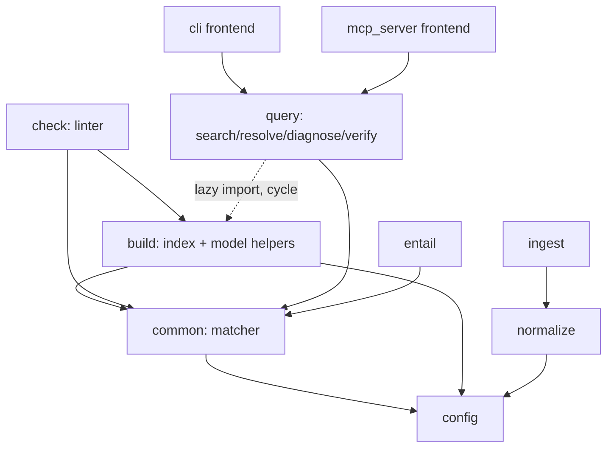
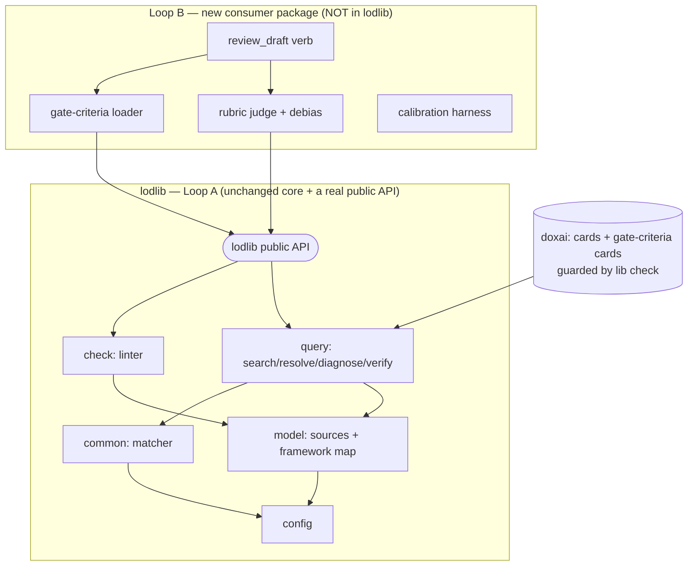

# Modularization before Loop B — the boundary that actually matters

**Status:** design-note / architecture assessment. **Date:** 2026-07-28.
**Driver:** the two-loop direction (`supervising-agent-architecture-2026-07-28.md`): lodlib is
**Loop A** (encode expertise: retrieval + fail-closed provenance); the supervising agent is
**Loop B** (judge a draft → Go/Kill/Hold/Recycle), to be built as a **separate consumer**, not a
rebuild of lodlib. This note answers *"how should we modularize before adding Loop B (or any
feature)?"* — investigated against the actual codebase, not in the abstract.

## TL;DR — do NOT restructure the guts

The codebase is **small and healthy** (11 modules, ~3.3k LOC, one clean foundation, exactly one
import cycle). The temptation to "modularize before adding features" usually means shuffling files;
here that would be gold-plating. The modularization that matters is **a boundary, not a file split**:
define lodlib's public Loop-A API so Loop B depends on a *contract* instead of reaching into
internals. That plus one cheap cycle-break is the whole job.

## Current structure (measured)

| Module | LOC | Responsibility |
|---|---:|---|
| `config` | 147 | config loading — **the leaf; everything depends on it** |
| `common` | 283 | the anchor matcher (`parse_markers`/`resolve`/`occurs`/`haystacks`) — the core primitive |
| `build` | 252 | INDEX build **+** library-model helpers (`framework_source_map`, `bib_line_for`, `source_sha256`, …) |
| `check` | 339 | the citation-rot linter (fail-closed) |
| `query` | 499 | search (BM25) · lenses · resolve/`Resolution` · diagnose · verify — **the growth hotspot** |
| `normalize` / `ingest` | 375 / 229 | text cleanup · PDF/EPUB ingestion (optional OCR deps, lazily imported) |
| `entail` | 169 | optional entailment layer |
| `cli` / `mcp_server` | 458 / 540 | the two frontends |

**What's already good** (keep): `config` is a clean leaf; `common` is a genuine reusable primitive;
`cli` lazily imports each command's module so `import lib` stays cheap and OCR deps stay optional;
`mcp_server` depends on `query` alone. This is a well-factored small package.

**The two real seams:**

1. **`query → build` cycle.** `query.resolve_consult` lazily imports `framework_source_map` from
   `build` "to avoid an import cycle." The cause: `build.py` mixes the *build operation* with
   *library-model helpers* (`framework_source_map`, `bib_line_for`, `source_sha256`, `humanize`,
   `title_from_bib`) that `query` and `check` also need. The model is buried inside the operation.
2. **Frontend render duplication.** `cli` (4 render helpers) and `mcp_server` (9 tool helpers) both
   format dimensions/frameworks/sources. The *policy* is now centralized (`query.resolve` +
   `Resolution`), but the *rendering* still lives twice. Every new verb (e.g. `review_draft`) is
   two edits.

## The modularization that matters (prioritized)

| Pri | Move | Why now | Size |
|---|---|---|---|
| **MUST** | **Define lodlib's public Loop-A API.** `__init__.py` exports only `Config` today; a consumer must reach into `lodlib.query` / `lodlib.check` / `lodlib.common` internals. Curate the contract Loop B builds on — `verify` (the un-fakeable-citation primitive), `resolve`/`dimension`/`framework`, `search`, `diagnose`, `check` — into `__all__` (or a small `lodlib/api.py` facade). | Without it, every internal refactor breaks the consumer; **it is the Loop A/B boundary made real.** | S |
| **CHEAP WIN** | **Extract library-model helpers → `lodlib/model.py`** (`framework_source_map`, `bib_line_for`, `source_sha256`, `title_from_bib`, `humanize`); `build`/`query`/`check` import it. | Kills the one cycle + the lazy-import workaround; separates "the library's data model" from "the build operation" — the same seam Loop B's criteria-loading will use. | S |
| **GUARDRAIL** | **`query.py` stays Loop-A-only.** It already carries 5 concerns; hold the line: retrieval / resolution / verify — **never scoring or judging.** If it grows again, split the consult-console cluster (lenses+resolve+diagnose) from search and from verify. | Prevents the god-module; keeps Loop B out of Loop A by construction. | — |
| **PRINCIPLE** | **Loop B is a separate package.** `review_draft`, the rubric judge, gate-criteria loading/scoring, and the calibration harness live *outside* lodlib and `import lodlib`'s public API + `verify`. The `gate-criteria` **cards** live in doxai (data, guarded by `lib check`), not in lodlib code. | The notes' own rule ("don't touch the core"); doxai's `engine/` is a *generative* engine, so Loop B is genuinely greenfield and must not be wedged into either. | — |
| **WATCH** | **Frontend view-model.** If a third frontend or the `review_draft` verb lands, extract "what to show" (a view object) from "how to format" so `cli`/`mcp` stop duplicating. Not worth doing pre-emptively. | Two frontends is tolerable; three is a refactor. | later |

## Target shape

## What NOT to do

- **Don't split the 11 files into sub-packages** for its own sake — the package is small; premature
  layering adds friction, not clarity.
- **Don't add `review_draft` / scoring to lodlib.** That collapses the Loop A/B boundary the whole
  design rests on.
- **Don't build Loop B before the public API exists** — you'd couple it to internals you'll then be
  afraid to refactor.

## Sequence

1. `model.py` extraction + public-API definition (both small, mechanical, fully covered by the 114
   tests) — **this is the "modularize before features" step, and it's ~an afternoon.**
2. Then the Loop-B walking skeleton (one gate-criteria card + `review_draft` prototype grounding
   defects via `verify` + a 10–15 draft gold set) in its **own** package.
