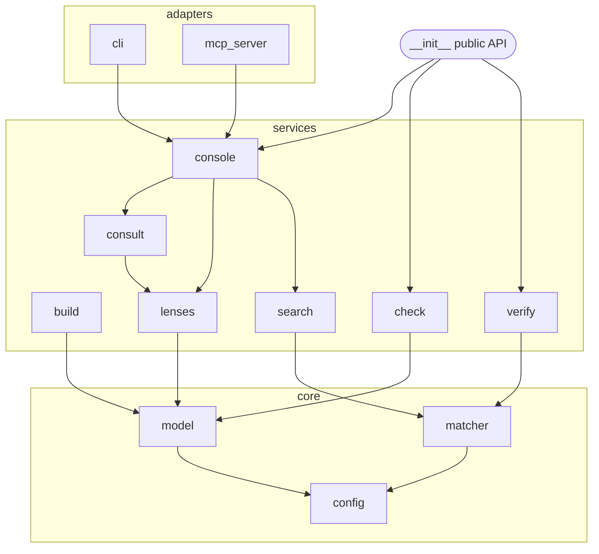

# Modularization plan — layer lodlib into a platform (the "right", not the cheap, cut)

**Status:** plan / architecture decision. **Date:** 2026-07-28.
**Supersedes** the recommendation in `modularization-before-loop-b-2026-07-28.md` (which optimized for
minimal change and mis-filed the frontend duplication as a "watch item"). Driver unchanged: lodlib is
**Loop A**, the supervising agent is **Loop B** (a separate consumer). This plan makes lodlib a clean
*platform* for that consumer and for future features, choosing the structure that is **right for the
trajectory**, not the one that is cheapest today.

## Thesis (revised)

The flat 11-module package is fine for a *tool*; lodlib is becoming a *platform with external
consumers*. The right structure has three properties the flat one lacks, each with a concrete
mechanism — not style:

1. **A real public-API facade.** Consumers (Loop B, others) couple to a *contract*, not to
   `lodlib.query` internals; lodlib then refactors internals freely. Today `__init__.py` exports only
   `Config` — there is no contract, so any consumer reaches into internals and freezes them.
2. **A shared application layer ("console") with thin frontends.** *Mechanism:* the CLI/MCP drift bug
   class becomes structurally impossible — one place decides *what* to return, adapters only decide
   *how to format*. **Evidence:** parity defect §6 (CLI printed a card, MCP redirected, on the same
   input) was exactly this duplication; `Resolution` patched the policy but the rendering is still
   forked. Every new verb (`review_draft`) is otherwise two edits and a fresh chance to drift.
3. **Enforceable dependency direction.** *Mechanism:* a domain core that imports nothing outward keeps
   provenance/matcher logic un-entangled from operations and delivery, and a tiny import-direction
   test makes the layering CI-enforced rather than aspirational.

This is a **standard** layered / ports-and-adapters shape. Non-goals below keep it from turning into
cargo-cult (no DI framework, no abstract ports for single implementations, no deep nesting).

## Target architecture

```
lodlib/
  __init__.py         PUBLIC API FACADE — the only surface a consumer imports; nothing else is contract
  config.py           foundation (unchanged)
  core/               the pure domain — imports only config, nothing outward
    matcher.py        the anchor matcher (was common.py): parse_markers / resolve / occurs / haystacks
    model.py          library model + framework_source_map / bib_line_for / source_sha256 / humanize
                      (extracted from build.py — this breaks the one import cycle)
  services/           application operations — import core + config, never adapters
    build.py check.py ingest.py normalize.py entail.py   (build loses its model helpers to core/model)
    search.py         BM25 retrieval                     (from query.py)
    lenses.py         Lens loading: lenses/framework/dimension/sections/gate_verdict (from query.py)
    consult.py        resolve/Resolution/LensMatch + diagnose/_cue_hit  (from query.py) — name+symptom routing
    verify.py         quote verification                 (from query.py)
    console.py        THE SHARED APP LAYER: consult()/diagnose() return STRUCTURED results, zero formatting
  adapters/           thin delivery — import services, format only, hold no policy
    cli.py mcp_server.py
  __main__.py
```

Dependency rule (one arrow direction, testable): `adapters → services → core → config`. `core` imports
nothing but `config`; adapters never import adapters.



## Move map (what goes where — exhaustive)

| From | Symbol(s) | To |
|---|---|---|
| `common.py` | whole matcher | `core/matcher.py` |
| `build.py` | `framework_source_map`, `source_sha256`, `title_from_bib`, `bib_line_for`, `humanize` | `core/model.py` |
| `build.py` | `build()`, `_enumerate_sources`, `_zoom_counts`, INDEX writer | stays `services/build.py` |
| `query.py` | `search`, `Hit`, BM25 consts | `services/search.py` |
| `query.py` | `Lens`, `lenses`, `framework`, `dimension`, `framework_sections`, `sections`, `body`, `card_title`, `gate_verdict` | `services/lenses.py` |
| `query.py` | `LensMatch`, `resolve_consult`, `resolve`, `Resolution`, `_name_tokens`, `diagnose`, `_cue_hit`, `_load_diagnostics` | `services/consult.py` |
| `query.py` | `verify`, `Verification` | `services/verify.py` |
| *(new)* | `consult(cfg, name) -> ConsultResult`, `diagnose(cfg, symptom) -> DiagnoseResult` (structured, no strings) | `services/console.py` |
| `cli.py`/`mcp_server.py` | the `_render_*` / `_tool_consult_*` bodies | become formatters over `console.*` |
| `__init__.py` | curated exports | the public facade |

## Phased execution — each phase is behavior-preserving and test-gated

**Invariant for every phase:** 114 tests green **and** `lib check` 0/0 **and** CLI/MCP output
byte-identical to baseline. Do it on a branch; commit per phase.

- **P0 — Baseline + safety net.** Snapshot golden CLI/MCP outputs for a fixture library (consult a
  dimension/framework/source, diagnose, ambiguous, none) into a new `tests/test_golden.py`. This is the
  regression net the refactor leans on. *Done when:* golden tests pass against current code.
- **P1 — `core/` extraction.** Create `core/matcher.py` (was `common.py`) and `core/model.py` (model
  helpers out of `build.py`). Update all imports; delete the `query→build` lazy import. *Done when:*
  tests green, no lazy cycle-avoidance import remains, `core/` imports only `config`.
- **P2 — Split `query.py` into `services/`** (`search`, `lenses`, `consult`, `verify`). Keep a
  transitional `query.py` re-exporting them so nothing outside breaks mid-phase; remove it at phase end
  once callers are updated. *Done when:* `query.py` is gone, tests green.
- **P3 — `services/console.py` (the load-bearing phase).** Define `ConsultResult`/`DiagnoseResult`
  (structured: outcome + payload + candidates + note). Move the consult/diagnose *policy + dispatch* out
  of both frontends into `console`. Rewrite `cli.cmd_consult`/`cmd_diagnose` and
  `mcp._tool_consult_*`/`_tool_diagnose` as pure formatters. Add `tests/test_console.py`. *Done when:*
  neither frontend contains resolution/routing policy; golden outputs unchanged; the CLI/MCP-drift test
  from the parity suite still passes and a new one asserts both format the *same* `ConsultResult`.
- **P4 — `adapters/` + public API facade.** Move `cli.py`, `mcp_server.py` to `adapters/`. Curate
  `__init__.py` into the public surface (`Config`; `check`; `verify`; `console.consult/diagnose`;
  `search`; `lenses.dimension/framework`) with `__all__` and a docstring naming it *the contract*. Add
  `tests/test_public_api.py`: a smoke test that does a full Loop-A round-trip **importing only
  `lodlib`** — this is the test Loop B will build against. *Done when:* the smoke test passes.
- **P5 — Guardrail + docs.** Add `tests/test_layering.py`: parse each module's imports, assert
  `core` imports nothing from `services`/`adapters`, `services` imports nothing from `adapters`, adapters
  don't import each other. Update `SPEC.md` with the layer map + the public-API contract; mark this plan
  done. *Done when:* the layering test passes and SPEC documents the contract.

Then Loop B starts in its own package against `import lodlib` — never touching internals.

## Non-goals (the line between "right" and cargo-cult)

- **No dependency-injection framework, no abstract "ports"/interfaces** for components with one
  implementation. lodlib is stdlib-only; keep it that way.
- **No deeper nesting than core/services/adapters.** Three layers is the mechanism; more is ceremony.
- **No renames that don't earn their keep** (`common → core/matcher` earns it: it names the thing;
  gratuitous renaming does not).
- **No behavior changes.** This is a pure restructure; any behavior change is a separate, later PR.
- **No Loop-B code in lodlib.** `review_draft`, judges, scoring, gate loading live in the consumer.

## Verification & rollback

- **Regression net:** 114 unit tests + the P0 golden CLI/MCP snapshots + `lib check` 0/0, run after
  every phase. The golden snapshots are what let a large move be proven behavior-identical.
- **New tests added:** `test_golden`, `test_console`, `test_public_api`, `test_layering`.
- **Rollback:** each phase is a commit on a branch; a failed phase is `git reset` of one commit, not a
  tangle. Nothing merges to `main` until all phases + Loop-A public smoke test are green.

## Cost & confidence

- **Effort:** ~1 focused day of agent-time; P3 (the console layer) is ~40% of it and the only part
  requiring real design; the rest is mechanical moves guarded by tests.
- **Confidence:** high that this is the right target shape given the platform trajectory. What would
  change it: if Loop B were abandoned and lodlib stayed a solo CLI tool forever, P3–P5 lose their
  mechanism and the cheap version (P1 only) would be right instead. The plan is worth doing *because*
  Loop B (and more consumers) are real.

## Definition of done

`import lodlib` exposes a documented, minimal Loop-A contract; the two frontends hold zero policy; the
one import cycle is gone; a layering test enforces the dependency direction in CI; 114+new tests green;
`lib check` 0/0; behavior byte-identical to today. lodlib is then a platform, and Loop B is a clean
consumer of it.
