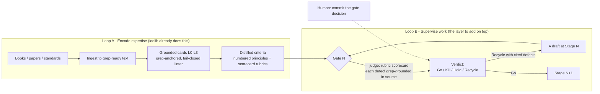

# From knowledge base to supervising agent: the two-loop architecture

**Status:** design-note / external review. **Date:** 2026-07-28.
**Scope:** The question this note answers — *"I have books/sources for one domain; how do I turn
them into an agent with skills and criteria that supervises my future work, workflow, and stage
gates?"* — and where lodlib sits in that answer. Written as an external design review cross-checked
against two background research sweeps (Anthropic Agent Skills / evals, LLM-as-judge rubric research,
Cooper's Stage-Gate, Constitutional AI). Companion note:
[`stage-gate-criteria-from-cooper-2026-07-28.md`](stage-gate-criteria-from-cooper-2026-07-28.md)
grounds the gate half of this in a primary source.

This extends, not supersedes,
[`knowledge-base-research-conclusion.md`](knowledge-base-research-conclusion.md) (2026-07-21) — which
already framed the supervision layer as *future* ("lodlib today solves (1) well and touches (3); it
cannot yet express (2)") and adopted the governing rule "agents generate candidates; only a human
promotes them to canon." This note names the missing layer's shape and how it bolts onto lodlib
without corrupting the provenance guarantee.

---

## 1. The reframe: this is two loops, not one

"An agent with skills and criteria that supervises my work" is two separable machines. Professionals
in the space build and reason about them separately:

| | **Loop A — Encode expertise** | **Loop B — Supervise work** |
|---|---|---|
| Job | Turn sources into knowledge an agent can *faithfully quote* | Judge a piece of work against criteria and issue a verdict |
| Output | Grounded, retrievable, cited knowledge | Go / Kill / Hold / Recycle + cited defects |
| Core risk | Fabricated or drifted citations | A judge you can't trust (biased, uncalibrated) |
| Prior art | Agent Skills, RAG-with-provenance | LLM-as-judge, Stage-Gate, Constitutional AI |

**The load-bearing conclusion.** lodlib is an excellent **Loop A** and, by deliberate design, not a
**Loop B** at all. The criteria/scorer/gate machinery never lived here — it lived in the separate
**doxai** engine, and lodlib ships that layer disabled (`[frameworks] enabled = false` is the
default, `config.py`) and empty. So the honest verdict on "is lodlib optimal?" is: *it is not
sub-optimal, it is incomplete by design, and it is the correct half to have built first.* The
supervising agent is a thin layer that **consumes** lodlib — not a rebuild of it.

## 2. The reference architecture (five borrowed mechanisms)

Each is a concrete, reusable mechanism, not a slogan.

**1. Skills for the *procedure*, RAG for the *text*.** Anthropic Agent Skills use *progressive
disclosure*: a `SKILL.md` exposes only `name` + `description` (~30–50 tokens) until triggered, then
loads its body, then loads `references/` only when needed. This is structurally identical to lodlib's
own level-of-zoom (L0→L3). The division of labor: **Skills carry "how an expert proceeds and
judges"; RAG carries "the exact words of the source you must quote"; fine-tuning is a last resort**
(it cannot produce verifiable citations, which disqualifies it as the grounding layer). Criteria and
workflow are a Skill; book text is retrieval — which is what lodlib already is.

**2. Stage-Gate is the skeleton for "workflow + gates."** Cooper's gate has three parts —
deliverables, criteria (must-meet knockouts + should-meet scorecard), and an output decision
(Go / Kill / Hold / Recycle). The verdict that matters most for a *supervisor* is **Recycle**: "send
back with specific defects," where most real work lands. Full grounding in the companion note.

**3. The gate's judge is an LLM-as-judge with a rubric.** The battle-tested pattern is G-Eval's
two-step form-filling: (a) give the judge the criteria and have it expand them into explicit
evaluation *steps*; (b) feed the draft back and have it fill a form — a numeric score per dimension.
Judges reach >80% agreement with humans *once the named biases are neutralized*:

- **Position bias** (favors options by slot) → *balanced permutation*: shuffle answer and
  rubric-option order, average. This is the single most severe bias in 2026 rubric-judge studies.
- **Self-enhancement bias** (a model over-rates its own family's output) → judge with a *different*
  model than the one that produced the work.
- **Calibration is non-optional** — build a small human-scored gold set, measure judge-vs-human
  agreement, trust only where they agree.

**4. Constitutional AI is the critique-and-revise engine.** Turn "the standards in a book" into an
automated reviewer: extract 10–30 numbered principles, each with a source citation, then run
`generate → critique against a principle → revise` in a loop. Identical to Anthropic's
Evaluator-Optimizer pattern; Stage-Gate is the domain-language version of the same loop.

**5. Evals before the agent; treat the judge as an instrument.** Define success criteria and evals
*first*. The test for a good gate criterion: *would two domain experts independently reach the same
pass/fail verdict?* If not, the criterion is under-specified — fix the criterion, not the judge. Hold
a *supervising* agent to **pass^k** (rejects bad work every time), not pass@k (sometimes). Wire
must-meet criteria as deterministic assertions and should-meet as an `llm-rubric` in a harness
(Promptfoo) so gates run in CI; optionally auto-tune the judge prompt (DSPy) against the gold set.

The single most reusable primitive across all five: **a rubric expressed as a scored form,
per-dimension, with cited sources.** It is simultaneously the Skill's payload, the judge's input, the
gate's criteria, and the optimizer's metric.

## 3. Where lodlib stands

**Keep — do not rebuild. These are the hard parts, and they are right:**

- **Fail-closed grep provenance.** The #1 documented failure mode of source-grounded judges is
  "cited but not verified" — the agent cites a source that doesn't support the claim. lodlib's
  literal-grep, fail-on-drift linter (`check.py`, check F) *structurally eliminates* that failure
  mode. A generic RAG judge cannot make that guarantee. This is the crown jewel and the reason a
  Loop B built on lodlib will be more trustworthy than one built on plain RAG.
- **Level-of-zoom retrieval** mirrors Skills' progressive disclosure; the token economy is what makes
  a *citing* judge affordable at every gate.
- **Governance posture already correct.** "Agents generate candidates; only a human promotes them to
  canon"; autonomous scoring rejected as "epistemic laundering." This is exactly the
  human-in-the-loop-at-the-gate guardrail serious compliance copilots enforce.
- **Preserving disagreement** between frameworks (not averaging them) and the `status:`/tier
  epistemic label — most systems flatten this. Keep.

**The gap (why it is not yet the supervising agent):**

1. **No supervision verb.** Every `craft-library` MCP tool — `consult_dimension`, `consult_framework`,
   `list_lenses`, `diagnose`, `search_sources`, `zoom_card`, `verify_quote` — is *read-only
   consultation*. There is no "submit a draft → score against criteria → return a verdict" tool. That
   one missing verb is the boundary between "a knowledge base an agent consults" and "an agent that
   supervises work."
2. **The criteria layer ships empty.** The sockets exist — the `frameworks` / `_syntheses` / lenses
   layer, the `_FW_SECTION_KEYS` 8-section framework shape (engine, primitives, mechanism, practices,
   boundary, stance, disagreement, on_dimension), the `_diagnostics.md` symptom→dimension router, and
   `GATE-TRIAGE.md` — but the layer is off by default and carries no gate-criteria instances.
3. **No stage/gate/workflow object for downstream work.** `GATE-TRIAGE.md` gates promotion of
   *library claims to canon*, not *a user's drafts*. Different thing.
4. **No calibration loop.** The `eval/` harnesses measure the *library's* retrieval (BM25 MRR, token
   cost), never the *judgment* quality of anything produced with it.

## 4. The build plan: Loop B on top of lodlib

Do **not** touch lodlib's core. Add Loop B as a thin consumer:

1. **Populate the dormant layer with real criteria.** Per craft dimension, author a card holding
   (a) 10–30 numbered principles distilled from the sources, each grep-anchored, and (b) a should-meet
   scorecard (dimensions × 0–10). This is authoring work — and the cheapest place to do it well is
   inside lodlib's discipline, because the anchors are guarded by `lib check`.
2. **Add the one missing verb.** A `review_draft(draft, stage)` capability (a new MCP tool, or an
   external Promptfoo config) that: selects the gate's criteria from lodlib → runs the two-step judge →
   **grounds every cited defect back through `verify_quote`/grep** → returns a scorecard + verdict.
   This reuses the provenance guarantee to make the *judge's* citations un-fakeable — the thing no
   off-the-shelf reviewer can do.
3. **Wrap it in critique-and-revise** with 2–3 worked `(draft → critique → revision)` examples in the
   prompt (Constitutional AI found this few-shotting necessary or the model "loses its point of view").
4. **Build a 20–50 draft gold set**, scored by hand; measure judge-vs-human agreement; apply
   balanced-permutation to kill position bias; ship only gates that clear the bar. Version rubric
   objects by reusing the existing `source_sha256` / `review_by` / `superseded_by` freshness pattern,
   applied to criteria rather than sources.
5. **Keep the human as committer.** The agent *recommends* the verdict; the human presses the button.
   Already lodlib doctrine; also the professional consensus.

## 5. Grounding decision (RAG vs skill vs fine-tune)

| Layer | Mechanism | Why |
|---|---|---|
| The source text itself | **RAG with provenance** (= lodlib) | Need faithful quotation with citation; fine-tuning cannot give verifiable citations |
| The distilled expertise (rubrics, workflow, gates) | **Skill / prompt grounding** | Procedural, prescriptive; belongs in a loadable, versioned artifact |
| House tone/format at high volume | **Fine-tune, last resort only** | Only after strong prompts + retrieval fail; still can't cite |

Provenance discipline (the lodlib edge): require the judge to attach a source span to every normative
claim, and verify the span actually contains the asserted content — a cheap grep/entailment check.
This directly counters the "cited but not verified" failure mode.

---

## Load-bearing sources

- Anthropic — Equipping agents for the real world with Agent Skills:
  https://www.anthropic.com/engineering/equipping-agents-for-the-real-world-with-agent-skills
- Anthropic — Building Effective Agents: https://www.anthropic.com/research/building-effective-agents
- Anthropic — Demystifying evals for AI agents:
  https://www.anthropic.com/engineering/demystifying-evals-for-ai-agents
- Liu et al. — G-Eval (arXiv:2303.16634): https://arxiv.org/abs/2303.16634
- Zheng et al. — Judging LLM-as-a-Judge (arXiv:2306.05685): https://arxiv.org/abs/2306.05685
- Position bias in rubric-based LLM-as-a-judge (arXiv:2602.02219): https://arxiv.org/html/2602.02219
- Bai et al. — Constitutional AI (arXiv:2212.08073): https://arxiv.org/pdf/2212.08073
- Cited but Not Verified — source attribution (arXiv:2605.06635): https://arxiv.org/pdf/2605.06635
- Cooper — Stage-Gate (grounded in the companion note): Robert G. Cooper, *Winning at New Products*
- DSPy: https://dspy.ai/ · Promptfoo: https://www.promptfoo.dev/docs/
